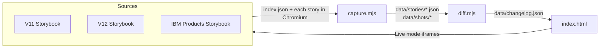

# Carbon V12 Before & After

A site that shows every Carbon React component in V11 and V12 side by side, plus a changelog of what changed, so product teams can see the impact before they upgrade.

- **Live site:** https://sstrubberg.github.io/carbon-v12-compare/
- **Status:** working prototype. It refreshes itself every other Thursday. This README is the handoff: what's here, how it works, and why it's built this way.

Nothing in this repo is hand-maintained content. Every screenshot, style value and changelog row is captured from the live Storybooks and computed, so the site stays accurate as V12 keeps moving.

## Quick start

```bash
npm install && npx playwright install chromium
npm run capture     # load every story in the Storybooks, record styles + screenshots → data/
npm run diff        # compare the captures → data/changelog.json + data/CHANGELOG.md
npm run serve       # the site at http://localhost:4321
```

A full capture takes about 15 minutes on a laptop, or 6–10 minutes on GitHub Actions. After that it's incremental: only stories whose Storybook build changed are recaptured. Useful flags:

| Flag | What it does |
|---|---|
| `--only a,b` | Only stories whose id contains `a` or `b` (e.g. `--only components-button--,components-tag--`) |
| `--force` | Recapture even if the builds haven't changed |
| `--concurrency N` | Parallel story pairs (default 4; CI uses 6) |
| `--limit N` | Stop after N stories (handy when changing the capture) |

## How it fits together



1. **`capture.mjs`** reads each Storybook's story list (`/index.json`) and pairs stories across versions. It opens every pair in headless Chromium and records three things for both sides: a screenshot, the computed styles of every Carbon element, and, for elements that changed, the CSS declaration (and so the Carbon token) that set each changed value. It also pixel-diffs the screenshots.
2. **`diff.mjs`** lines up elements between the two sides, works out what changed and which component each change belongs to, and writes a per-component changelog.
3. **`index.html`** is a static, dependency-free page that reads the changelog. Its **Live** and **Wipe** modes embed the real stories from the Storybooks in iframes; **Pixel diff** uses the captured images.
4. **`.github/workflows/refresh.yml`** runs steps 1–2 on a schedule and deploys the site.

## What's in the repo

| Path | What it is |
|---|---|
| `capture.mjs` | The capture (Playwright). Everything that touches a browser lives here. |
| `diff.mjs` | Turns captures into the changelog. Pure Node, no browser. |
| `index.html` | The whole site: markup, CSS and JS in one file, no build step. |
| `serve.mjs` | A tiny static server for local use (`npm run serve`). |
| `.github/workflows/refresh.yml` | Scheduled capture, changelog commit and Pages deploy. |
| `data/*.json`, `data/CHANGELOG.md` | Committed outputs (small). See below. |
| `data/stories/`, `data/shots/` | Raw captures and screenshots (large). **Not committed**; they live in the Actions cache and the Pages deploy. |

### Data files

| File | Written by | Contents |
|---|---|---|
| `manifest.json` | capture | Story pairing: `matched` (V11↔V12), `migrated` (IBM Products↔V12), plus stories and titles found in only one version |
| `meta.json` | capture | When and against which builds the capture ran |
| `docs.json` | capture | The V12 Storybook's *Changelog* and *Feature Flags* pages, parsed |
| `tokens.json` | capture | `--cds-*` custom properties that differ between the V11 and V12 compiled CSS |
| `captures.json` | capture | One summary row per captured story: pixel diff, element counts, errors |
| `stories/<id>.json` | capture | Everything for one story: both sides' elements with computed styles, authored values, clip rectangle and pixel diff |
| `changelog.json` | diff | What the site reads: every component with its status, stories and changes |
| `CHANGELOG.md` | diff | The same changelog, human-readable |

## The capture in detail

**Pairing stories.** V11 and V12 stories are paired by identical story id. Two exceptions:
- **Graduated feature-flag stories.** V11 stories under a component's *Feature Flag* folder that graduated into the component in V12 (`…-feature-flag--floating-styles` → `…--floating-styles`) are paired too, marked `flag-graduated`.
- **Migrated components.** Components new to `@carbon/react` but already in Carbon for IBM Products are paired with their IBM Products stories instead (see [the decisions below](#decisions-and-why)).

**Rendering.** Every page loads at 1280×800 with device pixel ratio 1, reduced motion, animations and transitions frozen, fonts and images loaded, and the pointer parked. The capture waits for Storybook to fill `#storybook-root` (or show its error panel), then for the network to go quiet, then for two animation frames.

**Elements.** Every element with a `cds--` (or `c4p--`) class is recorded, including portals outside `#storybook-root` (modals, menus). Each element is keyed by `sorted classes @ DOM path`, where the path is each ancestor's tag and Carbon classes plus a sibling index. That key is what lines the two versions up. The recorded properties are in `PROPS` at the top of `capture.mjs`: box model, colors, borders, radii, shadows, type, outline. `::before`/`::after` are recorded too.

**Screenshots.** Both sides are cropped to the same rectangle: the union of everything that actually paints on either side, plus 16px. So the images overlay exactly, and a moved or resized element shows up in the pixel diff. The pixel diff uses pixelmatch with threshold 0.1, ignoring anti-aliasing.

**Tokens.** For elements whose computed styles differ, the capture asks Chrome over the DevTools protocol (`CSS.getMatchedStylesForNode`) which declaration wins for each changed property, and stores the authored text, e.g. `var(--cds-field)` or `.25rem`. `winningValue()` follows the cascade: rule order, `!important`, inline styles, inheritance for text properties. It also maps each physical property to the logical and shorthand declarations that can set it (`padding-left` ← `padding-inline-start` ← `padding-inline` ← `padding`).

**Incremental runs.** Each Storybook build gets a fingerprint: a hash of its `index.json` plus the hashed name of its `iframe-*.css` bundle. A story is skipped when it was last captured against the same fingerprints *and* the same capture schema (a hash of `PROPS` and the in-page collection code). So changing what gets recorded automatically invalidates old captures.

## The diff in detail

**Aligning elements.** Pass 1 pairs identical keys. Pass 2 pairs what's left by tag, depth and class overlap along the ancestor path. That keeps an element lined up when V12 adds a wrapper or modifier class; `cds--autoalign` on every tooltip was the case that forced this.

**Comparing.** Per-side values are folded into shorthands (`border-top/right/left`, a single `padding`), and colors are converted to hex. These are dropped as noise:
- size changes under 1px
- size changes on elements that paint nothing (no background, border or shadow)
- size changes on wrappers that belong to no component (Storybook padding differs between Storybooks)
- DOM moves of screen-reader-only elements

**Grouping.** Identical changes (same element kind, property, before and after) are merged across stories into one row that lists the stories it appears in.

**Ownership and status.** See [Direct vs inherited](#direct-vs-inherited-changes-option-a). Statuses: `changed`, `inherited`, `migrated`, `new`, `removed`, `unchanged`.

**Docs.** Feature flags are attached to components whose names appear in the flag or its description. Floating-styles flags go to components that had floating-styles stories. Dated changelog notes are attached to the components they mention.

## Decisions and why

These are the calls that shaped the prototype. Most came out of looking at real output and finding it misleading.

### Measure the live Storybooks, don't install packages
The Storybooks are the source of truth Carbon publishes for each version. Parts of V12 (the migrated IBM Products components) aren't in any published package yet, and the Storybook is where V12 changes first. Measuring rendered pages also captures the net effect of Sass, tokens, theming and JS, which reading source can't.

### Computed styles *and* screenshots
Styles say exactly what changed ("radius 0 → 999999px"). Screenshots catch what the recorded properties miss. The first version didn't record margins; Toggle's label gap changed from 16px to 8px and only the pixel diff noticed. The site flags any story where pixels changed but no recorded style explains it. That list is currently empty, and should stay that way.

### Record `background-image`, pseudo-elements and margins
The first property list (from the original brief) missed all three. V12 draws field borders with `background-image` gradients over a transparent border. Without it, the changelog claimed inputs "lost their fill". The lesson: if a new V12 treatment isn't showing up, check which CSS property it uses before trusting the changelog.

### Direct vs inherited changes (Option A)
Half the "changed" components had only changed because they *contain* a restyled Button or input. For example, UI Shell's only change was its Button becoming a pill. We label by **where the style lives**:
- A change is **direct** if it lands on the component's own elements.
- It's **inherited** if it lands on a nested component.
- A component whose changes are all inherited gets **Inherits changes** (a hollow ring on the site) instead of **Changed** (a solid dot).

We rejected Option B, "whatever a user sees as part of the component". It would need someone to decide by hand, for 50+ components, which parts count, and keep that current. Option A is automatic, and it points developers at the component to fix.

How ownership is decided:
1. A class named like a component belongs to it (`cds--text-input` → TextInput).
2. Otherwise it belongs to the component whose own stories most often *start* with that class, as a share of its stories. Umbrella groups (Fluid Components, Form, FormGroup) can't claim classes.
3. `OWNER_OVERRIDES` in `diff.mjs` fixes the few families the vote gets wrong (`btn` → Button, the three notification families, `icon-tooltip` → IconButton…).

**Evidence rule.** A change stays inherited unless the source component's own V12 stories *contradict* it: the same kind of element with a different value for that property. Evidence is keyed by the exact element kind (`cds--popover-content.cds--tooltip-content`), not the broader family, and border sides are compared individually. Toggletip's popover corners end at 4px while Popover's own end at 8px, so Toggletip is overriding them, which makes it direct.

### Components from Carbon for IBM Products are "migrated", not "new"
About 17 components are new to `@carbon/react` but not to Carbon; they come from Carbon for IBM Products, which will be deprecated when V12 goes GA. Calling them "new" would hide that teams already use them. They get their own status, and they're compared against their [IBM Products Storybook](https://ibm-products.carbondesignsystem.com) version instead of V11.
- **Detection:** IBM Products has a non-deprecated story group with the same name, or V12 tags the stories `ibm-products-migrated`. (NotificationsPanel isn't tagged but is in IBM Products.)
- **Story pairing:** same id, else same story name. Stories with neither stay **V12 only**, labeled "No IBM Products equivalent". We chose that over pairing them with the "closest" story, because mismatched pairs would make the pixel diff meaningless.
- **Class prefix:** IBM Products prefixes its own classes `c4p--` (see `prefix: "c4p"` in `@carbon/ibm-products`' `package-settings.js`); V12 uses `cds--`. The capture normalizes `c4p--` to `cds--` so elements line up, and the changelog reports the rename, since CSS overrides and test selectors on `c4p--` will break.

### Carbon tokens from the authored CSS, not reverse-mapped values
Designers and developers talk in tokens (`$field`, `$spacing-05`), not `#f4f4f4`. Mapping a computed value back to a token would guess wrong constantly: `#f4f4f4` is several tokens. Reading the winning declaration tells us exactly which token was used, as long as the token is a CSS custom property (`var(--cds-field)`).

**Sass tokens are the catch.** Some Carbon tokens only exist in Sass and compile to plain numbers, notably the radius scale (`$border-radius-04` → `0.25rem`, defined in `@carbon/layout`). The hosted Storybooks don't publish source maps (checked: none for V11 or V12 CSS; IBM Products' map covers JS only), so the compiled CSS can't tell us where a number came from. An early version flagged the new 4px corners as "hardcoded". Checking the published `@carbon/styles` Sass showed they're `$border-radius-04`. So:
- A radius that exactly matches the radius scale is reported as that Sass token, tagged **Sass** on the site.
- Every other plain value is tagged **literal**, meaning "not traceable from the compiled CSS", not "hardcoded".

To know for sure, read the component's rule in the published `@carbon/styles` Sass (`node_modules/@carbon/styles/scss/components/<name>/`), or build the Storybooks with source maps (see [Ideas](#ideas-for-next-steps)).

### Live components by default
The site first showed screenshots. Live iframes of the real stories proved more useful: people can hover, open menus and tab through forms in both versions. **Wipe** stacks two live iframes and clips the top one. Clipping also limits where clicks land, so each side stays interactive: V12 left of the divider, the older version right, so dragging left reveals the older version. The page renders both stories at the capture's 1280×800 and shifts them together so the captured content sits centered. **Pixel diff** stays image-based because it has to match the data the changelog came from.

### Only small files in git
Screenshots and raw captures are about 90 MB per run and change every run. Committing them would bloat history by that much every two weeks. The workflow keeps them in the Actions cache (so runs stay incremental) and publishes them in the Pages deploy. Only the small JSON outputs are committed, so git history doubles as a record of what changed between runs.

## Automation

`.github/workflows/refresh.yml`:
- **When it runs:** every other Thursday at 23:30 UTC (7:30pm EDT / 6:30pm EST), on any push to `main` that changes `index.html`, `capture.mjs` or `diff.mjs`, and on demand via **Run workflow** in the Actions tab.
- **Every other week:** GitHub cron has no biweekly option, so the job fires weekly and the first step skips odd epoch weeks.
- **What it does:** restores the previous capture from the cache, runs capture and diff, saves the cache, commits `data/*.json` and `data/CHANGELOG.md` if they changed, and deploys `index.html` plus data to GitHub Pages. Pages is configured to deploy from Actions, not from a branch.
- **No loops:** the bot's own commits only touch `data/`, so they don't retrigger the workflow.

## Known limitations

- **One theme, one viewport.** White theme at 1280×800. A Gray 100 pass, or narrow viewports, would need another capture pass per setting.
- **Hidden content isn't captured.** Tooltips, menus and other content that appears only on hover or click isn't in the default render. Tooltip's own stories never show their bubble, so the ownership rule has less evidence for it.
- **Ownership is a heuristic.** It's right for everything we've checked, but a new component with unusual class names can be misfiled. Fix it with a line in `OWNER_OVERRIDES`.
- **Token lookup has limits.** It only covers elements matched by identical key (up to 250 per story side), assumes left-to-right writing, and doesn't resolve `calc()` expressions. Other changes show computed values only. Values set by the browser's own stylesheet show no token. Sass-only tokens are invisible in compiled CSS, apart from the radius scale, which is matched by value.
- **Token lookups are slow.** They roughly doubled a full capture (7 → 14½ minutes on CI).
- **Rendering varies by platform.** CI runs on Linux, where text renders slightly differently from macOS. Both versions are always captured on the same machine, so comparisons stay fair, but CI and local numbers can differ by a few changes.
- **The IBM Products Storybook goes away after V12 GA.** Migrated comparisons will fail once it's gone; freeze the last good `data/stories` for those components before then, or drop the source.
- **Scheduled workflows go dormant.** GitHub disables scheduled workflows after 60 days without repo activity. The bot's commits count as activity, but a quiet stretch in Carbon could still trip it; re-enable it from the Actions tab.

## Working on it

- **Copies hosted outside GitHub Pages** load screenshots from the public site (`GITHUB_PAGES_BASE` in `index.html`), since screenshots aren't committed. On Pages and on localhost the page uses its own `data/shots/`. A copy elsewhere shows the public site's latest screenshots next to its own changelog, so keep its `data/` in step with `main`.
- **Don't commit local `data/`.** CI owns the committed data. Before committing code, run `git checkout -- data/`, then `git pull` after the workflow's commit lands.
- **Changing the capture** (`PROPS` or `collectStyles`) invalidates every capture and triggers a full recapture, locally and on CI. Test with `--only` first.
- **A change is attributed to the wrong component:** look up its element classes in the story's JSON, then add the class family to `OWNER_OVERRIDES` in `diff.mjs`.
- **A component is missing a token:** check the story's `stories/<id>.json` for an `authored` map on the element. Missing means the element wasn't an exact-key match or was over the cap. A `ua:` prefix means the browser's own stylesheet won.
- **Debugging one story:** `node capture.mjs --only <story-id> --force && node diff.mjs`, then open `data/shots/{v11,ibmp,v12,diff}/<id>.png` and the story JSON.

## Ideas for next steps

- A Gray 100 capture pass, with a theme toggle on the site
- Token coverage for similarity-matched elements, not just identical keys
- Capturing hover, focus and open states for popovers, menus and tooltips
- A "what changed since the last run" view, built from the committed changelog history
- Per-team views: which components a given product uses, and what changes for them
- **Run from the Carbon monorepo.** Building the Storybooks locally with CSS source maps would trace every value to its Sass file and line. That gives exact token names, including Sass-only ones, and exact ownership (the file path says which component a rule belongs to), and would replace both the slow DevTools lookup and the ownership heuristics. In the monorepo's CI it could also run on every pull request.
